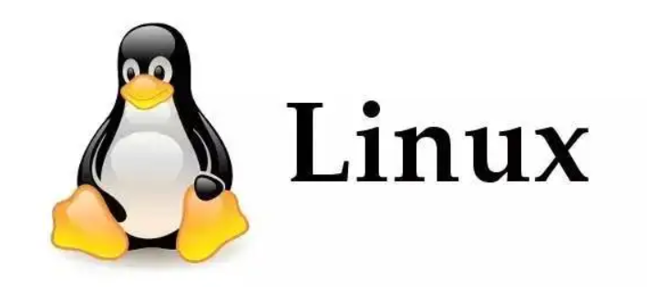
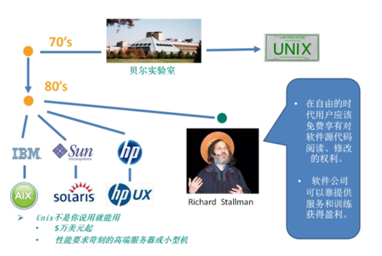
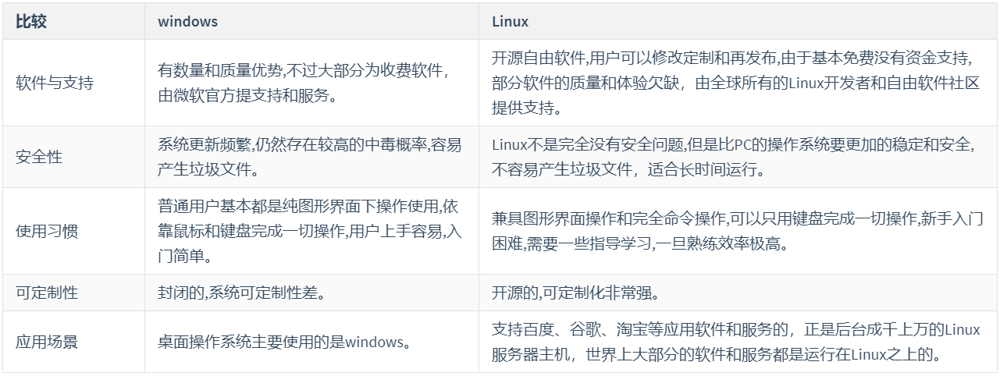
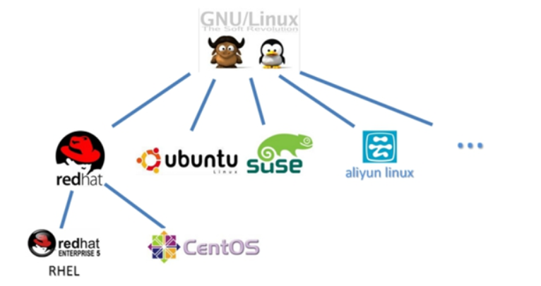

# 第一章 Linux 入门

## 学习目标

-   了解Linux 是什么
-   了解Linux的历史
-   了解 Linux 的特点
-   了解 Linux的应用场景
-   熟悉 Linux的常见版本

# 第一节 Linux是什么

Linux，全称GNU/Linux，其内核由林纳斯·本纳第克特·托瓦兹在赫尔辛基大学上学时出于个人爱好而编写的操作系统内核,于1991年10月5日首次发布,它主要受到Minix和Unix思想的启发，是一套免费使用和自由传播的类Unix操作系统,它是一个基于POSIX的多用户、多任务、支持多线程和多CPU的操作系统。它能运行主要的Unix工具软件、应用程序和网络协议。它支持32位和64位硬件。Linux继承了Unix以网络为核心的设计思想，是一个性能稳定的多用户网络操作系统。

# 第二节 Linux的历史

-   1946年2月14日在美国宾夕法尼亚大学诞生人类第一台计算机，用了18000个电子管，占地170平方米，重达30吨，耗电功率约150千瓦，每秒钟可进行高达5000次运算！！美国国防部用它来进行弹道计算！！

-   1969 年，Ken Thompson（C语言之父）利用汇编语言（B语言）开发了 File Server System（Unics，即 UNIX 的原型）。
-   1973 年，Dennis Ritchie 和 Ken Thompson 发明了 C 语言，随后二人使用C语言重写 UNIX 的内核。
-   1983年11月10日，为向IBM公司研发的计算机提供图形用户界面和多任务环境的操作系统，微软公司在纽约广场酒店宣布开发Microsoft Windows；同月，微软公司CEO比尔·盖茨向IBM展示了Windows的测试版本，命名为“界面管理器”（后经过营销专家罗兰·汉森的建议改为现名）
-   1985年11月20日，在宣布开发Windows两年后，微软公司正式发布Windows 1.0，硬件要求极高！！！最低256KB内存、两个双面软盘驱动器和一个图形适配卡。
-   1990年5月22日，Windows 3.0正式发布，改善了系统外观，增加了虚拟内存和VxD功能及程序管理器、文件管理器和打印管理器，在首销的六个月中便卖出了200多万份。

-   1991 年，芬兰赫尔辛基大学的研究生 Linus Torvalds 基于 gcc、bash 开发了针对 386 机器的 Linux 内核
-   1994 年，Torvalds 发布 Linux-v1.0。
-   1996 年，Torvalds 发布 Linux-v2.0，确定了 Linux 的吉祥物：企鹅
-   1997年经过许多失败的项目后，苹果于释出新操作系统——Mac OS的测试版，而后推出的正式版取得了巨大的成功。

# 第三节 Linux的特点

> 一 、一切皆文件

系统中的所有都归结为一个文件，包括命令、硬件和软件设备、操作系统、进程等等对于操作系统内核而言，都被视为拥有各自特性或类型的文件,每个文件都有确定的用途

> 二、 开源免费

用户可以通过网络或其他途径免费获得，并可以任意修改其源代码。正是由于这一点，来自全世界的无数程序员参与了Linux的修改、编写工作，程序员可以根据自己的兴趣和灵感对其进行改变，这让Linux吸收了无数程序员的精华，不断壮大。

> 三 、兼容POSIX.0标准

许多用户在考虑使用Linux时，就想到以前在Windows下常见的程序是否能正常运行，完全兼容POSIX.0标准使得可以在Linux下通过相应的模拟器运行常见的DOS、Windows的程序。这为用户从Windows转到Linux奠定了基础。

> 四、良好的图形用户界面

Linux同时具有字符界面和图形界面。在字符界面通过指令来进行操作。它同时也提供了类似Windows图形界面，用户可以使用鼠标对其进行操作。

> 五、多用户和多任务

Linux支持多用户，各个用户对于自己的文件设备有自己特殊的权利，保证了各用户之间互不影响。多任务则是现代电脑最主要的一个特点，Linux可以使多个程序同时并独立地运行。

> 六、支持多平台

Linux可以运行在多种硬件平台上，如具有x86、680x0、SPARC、Alpha等处理器的平台。此外Linux还是一种嵌入式操作系统，可以运行在掌上电脑、机顶盒或游戏机上。2001年1月份发布的Linux 2.4版内核已经能够完全支持Intel64位芯片架构。同时Linux也支持多处理器技术。多个处理器同时工作，使系统性能大大提高。

# 第四节 Linux的应用场景

Linux是一款开源、高效、稳定、安全漏洞少的操作系统，对程序员来说，其主要应用领域为服务端，是一款非常优秀的服务端操作系统。今天各种场合都有使用各种Linux发行版，从嵌入式设备到超级计算机，并且在服务器领域确定了地位，通常服务器使用组合：LAMP（Linux + Apache + MySQL + PHP）；LNMP（ Linux + Nginx+ MySQL + PHP  ）

> PC端Windows和服务端Linux对比

# 第五节 Linux的常见版本

> 严格来讲，Linux这个词本身只表示Linux内核，但实际上人们已经习惯了用Linux来形容整个基于Linux内核。各不同版本Linux，都是基于相同的内核版本，只是用的内核版本可能有高有低，同时各厂家自己加了自己有特点的工具，还有某些文件位置不一样，不同版本的Linux相同度可以达90%

> RedHat家族

-   Redhat企业版：  这个需要授权费，主要用在高要求的服务器商用系统
-   CentOS：CentOS全名为“社区企业操作系统”，CentOS社区将Red hat的网站上的所有源代码下载下来，进行重新编译。
-   Fedara：被红帽公司定位为新技术的实验场地，许多新的技术都会在 FC 中检验
-   其他 ：Scientific Linux  、Oracle Linux

> Debian 家族

-   Debian：运行起来极其稳定，这使得它非常适合用于服务器，Debian这款操作系统无疑并不适合新手用户，而是适合系统管理员和高级用户。
-   Ubuntu：Debian的一款衍生版，也是当今最受欢迎的免费操作系统,是一个以桌面应用为主的Linux操作系统
-   其他基于Debian的版本有：Linux Mint、Knoppix、MEPIS、sidux、CrunchBang Linux、Chromium OS、Google Chrome OS

> SUSE家族

-   SUSE：是欧洲大陆最流行的LINUX起源于德国，于2003年末被Novell收购
-   SUSE Linux ：针对个人用户，可以免费下载
-   SUSE Linux Enterprise Server&#x20;
-   SUSE Linux Enterprise Desktop
-   SUSE Manager
-   SUSE Studio

> Gentoo家族

-   Gentoo：是Linux世界最年轻的发行版本，正因为年轻，所以能吸取在她之前的所有发行版本的优点
-   Gentoo Linux
-   Sabayon Linux
-   Calculate Linux
-   Funtoo Linux
