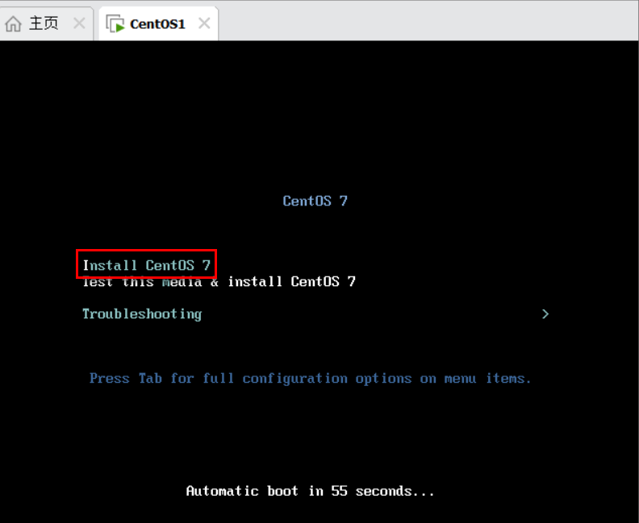
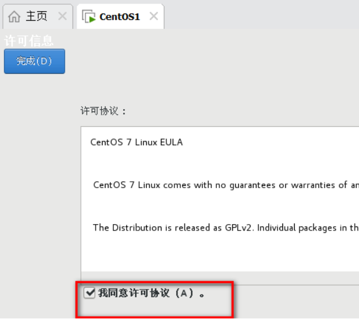
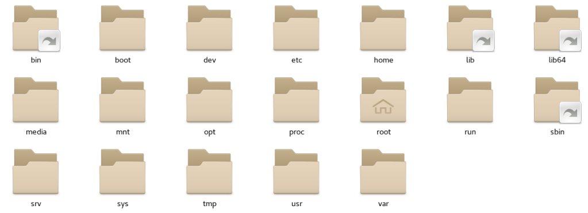
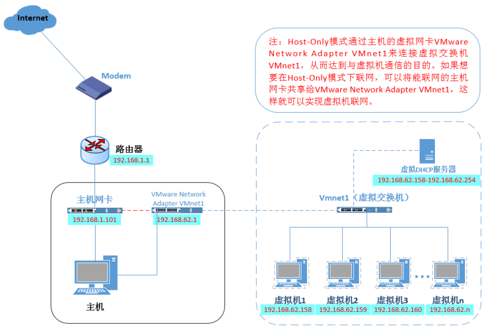
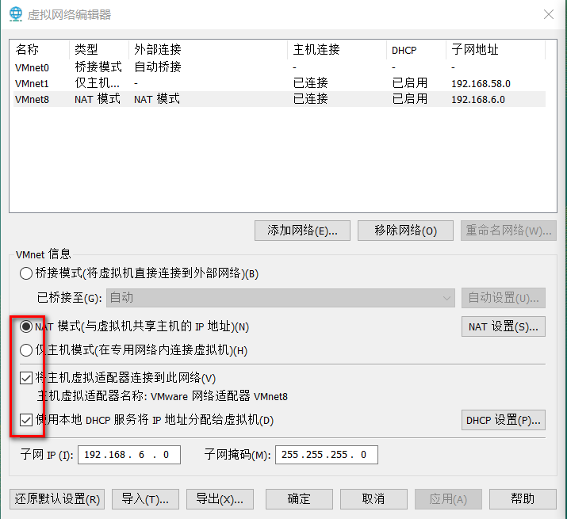

# part1 VMware的使用

## 学习目标

1 熟悉VMware软件的使用

2 可以熟练为虚拟计算机安装Linux操作系统

3 能独立解决安装过程中的常见问题

## 第一节 VMware的作用

> VMware软件的作用


-   第一步，在Windows上安装VMware软件
-   第二步，使用VM软件创建虚拟的计算机
-   第三步，在虚拟的计算机上安装Linux操作系统

## 第二节 VMware的安装

> 安装前，先检查BIOS中是否开启了虚拟化支持

-   打开任务管理器，查看性能，CPU部分，虚拟化处于“已启用”状态


-   如果没有开启，则需要进入BIOS系统，将 Virtualization Technology 改为Enalble，不同品牌的电脑进入BIOS的方式都不同，可以根据电脑品牌型号搜索对应的进入方式


> 第一步：下载VMware安装包([https://www.vmware.com/cn/products/workstation-pro/workstation-pro-evaluation.html](https://www.vmware.com/cn/products/workstation-pro/workstation-pro-evaluation.html "https://www.vmware.com/cn/products/workstation-pro/workstation-pro-evaluation.html"))，双击开始安装（注意：**建议管理员身份运行**）

> 第二步：点击下一步


第三步：同意协议，然后下一步


> 第四步：修改安装位置 勾选“添加到系统PATH”


> 第五步: 不检查更新，不参与客户体验提升计划


> 第六步：勾选“桌面”和“开始菜单程序文件夹”


> 第七步：开始安装


> 第八步：安装完成


> 第九步：点击桌面图标启动程序


> 第十步：购买软件后，获取许可证密钥，输入密钥即可正常使用。不购买可以试用30天。


第三节 VMware 创建虚拟机

> 第一步：选择创建新的虚拟计算机


> 第二步：选择自定义


> 第三步： 硬件兼容选择 Workstation 17.x。


> 第四步：选择稍后安装操作系统


> 第五步：预选将来要安装的操作系统和版本


> 第六步：自定义虚拟机名称和虚拟机的存储位置


> 第七步：设置虚拟计算机的CPU 数量，不要高于宿主机的实际


> 第八步：设置虚拟计算机内存，2G即可


> 第九步：设置虚拟计算机初始网络连接方式，建议使用NAT模式


> 第十步：选择I/O控制器类型，默认推荐即可


> 第十一步：选择磁盘类型，默认推荐即可


> 第十二步：选择创建新的虚拟磁盘


> 第十三步：设定虚拟磁盘大小，并拆分成多个文件


> 第十四步：检查虚拟磁盘文件名，默认即可


> 第十五步：检查虚拟计算机设置的信息，然后点击完成


> 第十六步： 安装完成


## 第三节 VMware安装Linux

> 第一步：下载Linux的ISO镜像文件，这里选择的版本是Centos7 64位

```纯文本
阿里镜像源网站：
https://developer.aliyun.com/mirror/
清华大学镜像源网站:
https://mirrors.tuna.tsinghua.edu.cn/
```

下载好的镜像文件存于一个比较稳妥的目录下


> 第二步：选中对应的虚拟机然后点击虚拟机选项，找到设置


> 第二步：找到CD、DVD选项>使用IOS 镜像文件>浏览>选择的IOS镜像文件


> 第三步：开启虚拟机，开始对虚拟机特征进行设置


> 第四步：选择 Install Centos 7



> 第五步：选择安装过程中使用的提示语言


> 第六步：设置时区，时间和日期，与计算机日期一致即可


> 第七步：软件选择GNOME，带有图形界面模式的Linux 然后点击完成


> 第八步：等待安装源和软件选择的支持检查


> 第九步： 设置安装位置，核对信息，然后点击完成即可


> 第十步： 设置网络和主机名，开启以太网，注意主机名和当前主机IP信息


> 第十一步： KDUMP崩溃存储机制，可以关闭


> 第十二步：开始安装


> 第十三步：设置超级管理员root用户的密码，配置完成，点击重启


> 第十四步：重启后，选择第一项，开启虚拟机


> 第十五步：第一次进入虚拟机，需要接受许可




> 第十六步： 选择汉语，然后前进


> 第十七步：选择输入，汉语，然后前进


> 第十八步：位置服务，可以关闭，然后前进


> 第十九步：选择时区，已经设置过，然后前进


> 第二十步：在线账号创建，选择跳过


> 第二十一步：创建用于第一次登陆系统的普通用户账号，这里绝对不可以使用root作为用户名


> 第二十二步： 设置普通账户密码


> 第二十三步：进入系统后，点击关机按钮，找到用户，选择注销


> 第二十四步：点击未列出，输入超级管理员的账号密码，以超级管理员身份登录，前面的用户设置重复一遍后，即可进入系统


输入root用户登录：


> 第二十五步：如果需要关机，一定要先将虚拟机关机或者挂起后，再关闭VMware，然后关闭windows


要想让鼠标从VMware的 虚拟中脱离出来，需要按快捷键 ctrl+alt

## 第四节 VMware常见问题

> 问题1 启动VM报0xc0000005，这是与windows Hyper-V服务冲突造成的


&#x20;         1 关闭以下服务


&#x20;         2 以管理员方式运行以下命令

```纯文本
bcdedit /set hypervisorlaunchtype off
```

&#x20;         3 重启电脑

> 问题2 启动VMware蓝屏问题

&#x20;         1 打开控制面板，点击卸载程序


&#x20;        2 点击启用或者关闭Windows功能


高版本的windows在不同的位置：

&#x20; 


3 勾选如下两个选项


# part2 Linux的目录结构

## 学习目标

1 熟悉Linux目录的组织习惯

2 熟悉一些Linux的常见目录及作用

## 第一节 Linux中的常见目录

> Linux常见的目录结构，不同版本的Linux目录结构可能略有不同


> Centos7的文件目录结构



> Linux根目录下的常见目录及作用

1\. /bin：★(/usr/bin,/usr/local/bin)

是Binary的缩写, 这个目录存放着最经常使用的命令,Linux默认的环境变量已经包含该路径,所以可以直接使用该路径下的指令如 cd指令&#x20;

可以通过echo \$PATH查看系统环境变量来看是否包含了该目录

2\. /sbin：(/usr/sbin, /usr/local/sbin)

s就是Super User的意思，这里存放的是系统管理员使用的系统管理程序。

以上6个目录，任何命令在任意目录下都可执行命令

3\. /home：★

存放普通用户的主目录，在Linux中每个用户都有一个自己的目录，一般该目录名是以用户的账号命名的。

4\. /root：★

该目录为系统管理员，也称作超级权限者的用户主目录。

5\. /lib：

系统开机所需要最基本的动态连接共享库，其作用类似于Windows里的DLL文件。几乎所有的应用程序都需要用到这些共享库。

6\. /lost+found：

这个目录一般情况下是空的，当系统非法关机后，这里就存放了一些文件。

7\. /etc：★

所有的系统管理所需要的配置文件和子目录。my.cnf

8\. /usr：★&#x20;

这是一个非常重要的目录，用户的很多应用程序和文件都放在这个目录下，类似与windows下的program files目录。

9\. /boot：★

这里存放的是启动Linux时使用的一些核心文件，包括一些连接文件以及镜像文件，自己的安装别放这里&#x20;

10\. /proc：

这个目录是一个虚拟的目录，它是系统内存的映射，我们可以通过直接访问这个目录来获取系统信息。

11\. /srv：

service缩写，该目录存放一些服务启动之后需要提取的数据。

12\.    /sys：&#x20;

这是linux2.6内核的一个很大的变化。该目录下安装了2.6内核中新出现的一个文件系统 sysfs 。（内核）

13\.    /tmp：

这个目录是用来存放一些临时文件的。

14\.    /dev：★

Device(设备)的缩写,类似windows的设备管理器，把所有的硬件用文件的形式存储。&#x20;

15\.    /media：★

linux系统会自动识别一些设备，例如U盘、光驱等等，当识别后，linux会把识别的设备挂载到这个目录下。CentOS6 就在/media下,CentOS7换目录了/


16\.    /mnt：★

系统提供该目录是为了让用户临时挂载别的文件系统的，我们可以将光驱挂载在/mnt/上，然后进入该目录就可以查看光驱里的内容了。

17\.    /opt：★

这是给主机额外安装软件所摆放的目录。

比如你安装JDK、Tomcat则就可以放到这个目录下。默认是空的。

18\.    /usr/local: ★

这是另一个给主机额外安装软件所摆放的目录.一般是通过编译源码方式安装的程序。

19\.    /var：★

这个目录中存放着在不断扩充着的东西，我们习惯将那些经常被修改的目录放在这个目录下。包括各种日志文件。

# part3 虚拟机网络配置

## 学习目标

1 熟练查看虚拟机网络配置信息

2 熟悉WMware的联网模式及特点

3 熟练在NAT模式下,将虚拟机IP设置为固定IP

## 第一节 查看网络信息

> 在VMware中查看当前虚拟机的联网模式


- 模式1  仅主机模式特点
  - 特点&#x20;
    - 虚拟机只能和宿主机之间实现通信
  - 缺点
    - 只有宿主机和虚拟机之前能通信,虚拟机联网需要做更多的配置



- 模式2 桥接模式特点
  - 特点
    - 宿主机和虚拟机,都是由局域网路由(DHCP)进行IP的分配
    - 宿主机和本地的虚拟机之间可以进行通信
    - 局域网内其他机器也可以与虚拟机进行通信
  - 缺点
    - 虚拟机会占用大量的IP,局域网内如果机器太多,或者虚拟机太多,那么会出现大量的IP冲突


- 模式3 NAT模式特点
  - 特点
    - 宿主机和其他机器的IP由局域网路由进行IP的分配,虚拟机的IP通过VMnet8虚拟交换机进行分配
    - 宿主机和本地的虚拟机之间可以进行通信
    - 不会占用宿主机所在路由IP,不会造成IP冲突
  - 缺点
    - 局域网内的机器无法与其他机器上的虚拟机进行通信


- 关于模式的选择
  - 什么时候选择NAT模式?
    - 在教室内,因为大量同学使用同一个路由,避免大量的IP冲突
    - 我们在学习阶段,主要满足我们自己的计算机(宿主机)和本地虚拟机之间的通信以及虚拟机的联网
  - 什么时候选择桥接模式?
    - 自己独立的路由,想在局域网内实现虚拟机和其他计算机之间的通信
  - 未来如何选择
    - 未来这些问题会由运维人员来处理
    - 未来我们使用的服务器不会在本地,使用远程服务器,自然也不需要我们来处理这种问题

## 第二节 修改网络配置信息

> 第一步:  打开VMware,打开虚拟网络编辑器


> 第二步: 选择NAT模式,对网段进行调整


> 第三步: 设置NAT模式的网关


> 第四步: 检查是否有漏选的选项



> 第五步: 修改虚拟机自己的网络模式选用模式为NAT


> 第六步: 修改虚拟机ens33网卡的网络配置信息


# part4 虚拟机管理操作

## 学习目标

1 熟练掌握虚拟机快照的使用和管理

2 熟练掌握通过克隆方式创建虚拟机

## 第一节 VMware为虚拟机拍摄快照

> 通过快照可快速保存虚拟机当前的状态,后续可以使用快照,将虚拟机还原到某个快照的状态. 如某个软件安装失败,可以通过快照快速还原回指定的某个状态

- 选择指定的虚拟机拍摄快照


- 输入快照名称,添加快照描述


- 通过快照恢复虚拟机状态


- 管理和废弃快照


## 第二节 VMware为虚拟机执行克隆

> 第一步: 关闭要克隆的虚拟机

> 第二步: 选中虚拟机,右击>管理>克隆


> 第三步: 可以选择虚拟当前状态和某个快照状态进行克隆


> 第四步: 创建完整克隆


> 第五步: 注意修改克隆之后的虚拟机的名称和存放路径


> 第六步: 克隆完成,关闭即可


> 第七步: 修改克隆出来的虚拟机的主机名和IP配置,然后重启

# part5 远程工具的使用

## 学习目标

1 熟练安装和使用Xhsell

2 熟练安装和使用Xftp

3 熟练安装和使用 finalshell

## 第一节 Xshell的安装和使用

> Linux一般作为服务器使用,服务器一般都放在机房,不可能是你身边的Linux服务器,这时候我们需要一些工具来连接远程的Linux服务器来进行操作,xshell就是一种远程连接工具,其他Windows上常见的远程登录客户端有 SecureCRT, Putty,SSHSecure Shell,等

> Linux系统中是通过SSH服务 实现的远程登录功能,默认ssh服务的端口号是22

- 双击安装程序,进行安装


- 开始安装


- 选择商业


- 接收许可协议


- 购买软件后输入密钥


- 选择合适的安装位置


- 选择程序文件夹,直接下一步


- 选择语言


- 安装进度


- 安装完成


- 重启windows计算机


- 启动Xshell,建立和服务器连接


- 输入虚拟机IP和连接名称


- 点击连接远程Linux


- 接受主机密钥并保存


- 输入并记住用户名


- 输入并记住密码


- 连接成功


- 设置字体大小


- 断开连接


- 查看已经创建好的连接


- 点击连接即可自动连接对应的服务器

## 第二节 Xftp的安装和使用

> 通过Xshell可以连接远程Linux服务器,并通过命令操作远程虚拟机,但是Xshell无法完成较大的文件上传和下载,此时需要Xftp来完成

- 安装过程和Xshell基本一致
- 安装完成后,可以通过XShell来开启Xftp,然后执行文件上传下载操作


- xshell连接虚拟机如果比较慢
  - 修改/etc/ssh 目录下的配置文件 sshd\_config 命令 vim/etc/ssh/sshd\_config
- 在sshd\_config 115行,将 UseDNS前面的#去掉,然后将值改为no
  - 重启虚拟机,应该就能很快连接上

## 第三节 finalShell的安装和使用

> finalShell是一款国产的服务器远程连接工具,集成了命令操作和文件上传功能,基础功能基本免费

- 双击安装包,开始安装


- 选择合适的安装位置


- 点击确定继续安装


- 安装完成启动程序创建连接


- 连接成功,查看已创建的连接列表


- 查看服务器目前的状态信息

