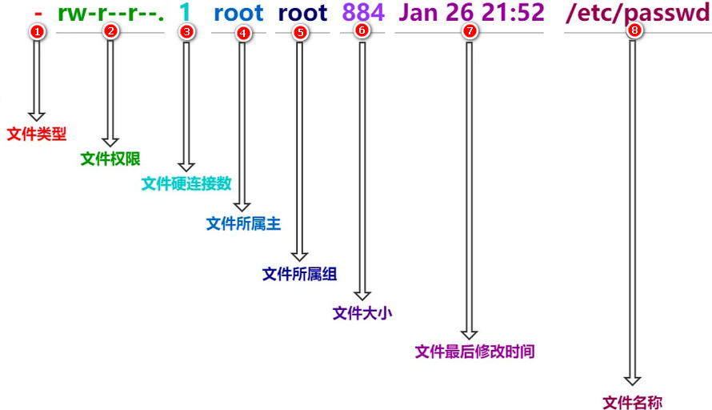

# 第三章 常见Linux命令

# 学习目标

1 了解Linux帮助类命令

2 熟悉开关机命令

3 熟练文件目录类命令

4 熟悉时间日期类命令

5 熟悉用户管理命令

6 熟悉组管理命令

7 熟练文件权限命令

8 熟悉搜索查找类命令

9 熟练压缩和解压缩命令

10 熟悉磁盘分区类命令

11 熟练进程线程类命令

12 了解系统定时任务命令

# 第一节 帮助类命令

> man获取帮助信息

- 语法

  -   man \[命令或配置文件]       （功能描述：获得帮助信息）
-   显示说明
    | 信息          | 功能           |
    | ----------- | ------------ |
    | NAME        | 命令的名称和单行描述   |
    | SYNOPSIS    | 怎样使用命令       |
    | DESCRIPTION | 命令功能的深入讨论    |
    | EXAMPLES    | 怎样使用命令的例子    |
    | SEE ALSO    | 相关主题（通常是手册页） |
-   实操案例
    -   查看ls命令的帮助信息
    ```纯文本
    [root@centos100 ~]# man ls
    ```

> help获得shell内置命令的帮助信息

- 基本语法

  -   help 命令 （功能描述：获得shell内置命令的帮助信息）
-   案例实操
    -   查看cd命令的帮助信息
    ```纯文本
    [root@centos100 ~]# help cd
    ```

# 第二节 开关机类命令

> 一般Linux不会经常进行关机操作,正确的关机流程为: sync>shutdown> reboot >poweroff

- 基本语法
  -   sync 将内存中的数据同步到硬盘中
  -   poweroff 关闭系统, 等同于shutdown -h now
  -   reboot 重启系统,等同于shutdown -r now
  -   shutdown\[选项] 时间

- 选项
  | 选项   | 功能          |
  | ---- | ----------- |
  | -h   | -h=halt关机   |
  | -r   | -r=reboot重启 |

- 参数&#x20;
  | 参数   | 功能             |
  | ---- | -------------- |
  | now  | 立刻关机           |
  | 时间   | 等待多久之后关机,单位为分钟 |

- 注意事项

  Linux系统中为了提高磁盘读写效率,对磁盘采取了"预读迟写"操作方式,当用户保存文件时,Linux核心并不一定对保存的数据立刻写入物理磁盘,而是将数据保存在缓冲区中,等缓冲区写满时再写入磁盘,这种方式可以极大的提高磁盘写入数据的效率.同时也带来了安全隐患. 如果数据还未写入磁盘时,系统掉电或者出现其他严重的问题造成宕机,可能会造成数据的丢失.使用sync指令可以立即将缓冲区的数据写入磁盘

  &#x20;

> 临时开关服务命令

- 语法

  - centos6
    - service 服务名 start 开启服务
    - service 服务名 stop 关闭服务
    - service 服务名 restart 重启服务
    - service 服务名 status 查看服务状态
  - centos7
    - systemctl start 服务名 开启服务
    - systemctl stop 服务名 关闭服务
    - systemctl restart 服务名 重启服务
    - systemctl status 服务名 查看服务
    - systemctl --type service 查看正在运行的服务

- 实操

  - 1 查看网络服务状态

  ```text
  systemctl status network.service

  ```

  - 2 关闭服务

  ```text
  systemctl stop network.service

  ```

  - 3 启动服务

  ```text
  systemctl start network.service

  ```

  - 4 重启服务

  ```text
  systemctl restart network.service

  ```

  - 查看所有服务

  ```text
  systemctl --type service

  ```

  .service后缀可以省略不写

> 永久开关服务命令

- 语法

  - centos6
    - chkconfig   查看所有服务自启配置
    - chkconfig 服务名 off  关闭服务自启
    - chkconfig 服务名 on   开启服务自启
    - chkconfig 服务名 --list  查看服务开机启动状态
  - centos7
    - systemctl enable 服务名          打开自启
    - systemctl disable 服务名         关闭自启
    - systemctl is-enabled 服务名     查看服务是否自启
    - systemctl list-unit-files      查看所有服务自启配置

- 实操

  - 1 关闭防火墙自动启动

  ```text
  systemctl status firewalld  查看防火墙
  systemctl disable firewalld  关闭防火墙自启

  ```

  - 2 开启防火墙自启

  ```text
  systemctl enable firewalld

  ```

  - 3 查看防火墙是否自启

  ```text
  systemctl is-enabled firewalld

  ```

  - 4 关闭网络管理器服务

  ```text
  查看服务systemctl status NetworkManager.service
  停止服务 systemctl stop NetworkManager
  查看自启动 systemctl is-enabled NetworkManager
  关闭自启动systemctl disable NetworkManager
  ```

Linux系统有7种运行级别(runlevel)：常用的是级别3和5(CentOS7中只有两个级别了：3和5)

运行级别0：系统停机状态，系统默认运行级别不能设为0，否则不能正常启动

运行级别1：单用户工作状态，root权限，用于系统维护，禁止远程登陆

运行级别2：多用户状态(没有NFS)，不支持网络

运行级别3：完全的多用户状态(有NFS)，登陆后进入控制台命令行模式

运行级别4：系统未使用，保留

运行级别5：X11控制台，登陆后进入图形GUI模式

运行级别6：系统正常关闭并重启，默认运行级别不能设为6，否则不能正常启动


# 第三节 文件目录类命令

> pwd(print working directory ) 打印当前工作目录的绝对路径

- 基本语法

  -   pwd    （功能描述：显示当前工作目录的绝对路径）
-   案例实操
    -   显示当前工作目录的绝对路径
    ```纯文本
    [root@centos100 ~]# pwd
    /root
    ```

> ls(list) 列出目录内容

- 基本语法

  -   ls \[选项] \[目录或是文件]
-   选项说明
    | 选项   | 功能                                |
    | ---- | --------------------------------- |
    | -a   | 全部的文件，连同隐藏档( 开头为 . 的文件) 一起列出来(常用) |
    | -l   | 长数据串列出，包含文件的属性与权限等等数据；(常用)        |
-   显示说明

    每行列出的信息依次是： 文件类型与权限 链接数 文件属主 文件属组 文件大小用byte来表示 建立或最近修改的时间 名字&#x20;
- 实操案例
  -   查看当前目录的所有内容信息
  ```纯文本
  [root@centos100 ~]# ls -al
  总用量 80
  dr-xr-x---. 15 root root 4096 11月  7 19:08 .
  dr-xr-xr-x. 17 root root  224 11月  3 20:18 ..
  -rw-------.  1 root root 1533 11月  3 20:19 anaconda-ks.cfg
  -rw-------.  1 root root 1996 11月  7 18:54 .bash_history
  -rw-r--r--.  1 root root   18 12月 29 2013 .bash_logout
  -rw-r--r--.  1 root root  176 12月 29 2013 .bash_profile
  -rw-r--r--.  1 root root  176 12月 29 2013 .bashrc
  drwx------. 15 root root 4096 11月  6 14:03 .cache
  drwxr-xr-x. 16 root root 4096 11月  6 17:00 .config
  -rw-r--r--.  1 root root  100 12月 29 2013 .cshrc
  drwx------.  3 root root   25 11月  3 20:25 .dbus
  -rw-------.  1 root root   16 11月  3 20:28 .esd_auth
  -rw-------.  1 root root 1550 11月  7 19:04 .ICEauthority
  -rw-r--r--.  1 root root 1581 11月  3 20:25 initial-setup-ks.cfg
  drwx------.  3 root root   19 11月  3 20:28 .local
  drwx------.  5 root root   66 11月  3 20:29 .mozilla
  -rw-r--r--.  1 root root 6939 11月  6 15:35 smartd1.conf
  -rw-r--r--.  1 root root 6792 11月  6 15:48 smartd.conf
  -rw-r--r--.  1 root root  129 12月 29 2013 .tcshrc
  -rw-------.  1 root root 4518 11月  7 19:08 .viminfo
  -rw-------.  1 root root  165 11月  7 18:55 .Xauthority
  ```

> cd(Change Directory)切换路径

- 基本语法

  -   cd \[参数]
-   参数说明
    | 参数        | 功能                 |
    | --------- | ------------------ |
    | cd 绝对路径   | **切换路径**           |
    | cd 相对路径   | **切换路径**           |
    | cd \~或者cd | 回到自己的家目录           |
    | cd -      | 回到上一次所在目录          |
    | cd ..     | 回到当前目录的上一级目录       |
    | cd -P     | 跳转到实际物理路径，而非快捷方式路径 |
    | cd /      | 回到系统根目录            |
-   实操案例
    -   使用绝对路径切换到root目录
    ```text
    [root@centos100 ~]# cd /root/
    ```
    -   使用相对路径切换到“公共的”目录
    ```text
    [root@centos100 ~]# cd 公共的/
    ```
    -   表示回到自己的家目录，亦即是 /root 这个目录
    ```text
    [root@centos100 公共的]# cd ~
    ```
    -   cd- 回到上一次所在目录
    ```text
    [root@centos100 ~]# cd -
    ```
    -   表示回到当前目录的上一级目录，亦即是 “/root/公共的”的上一级目录的意思；
    ```text
    [root@centos100 公共的]# cd ..
    ```

> mkdir(Make directory) 建立目录

- 基本语法

  -   mkdir \[选项] 要创建的目录
-   选项说明
    | 选项   | 功能     |
    | ---- | ------ |
    | -p   | 创建多层目录 |
-   实操案例
    -   创建一个目录
    ```text
    [root@centos100 ~]# mkdir xiyou

    [root@centos100 ~]# mkdir xiyou/yaojing
    ```
    -   创建一个多级目录
    ```text
    [root@centos100 ~]# mkdir -p xiyou/qujing/meihouwang
    ```

> rmdir(Remove directory) 删除目录

- 基本语法

  -   rmdir 要删除的**空目录**
-   实操案例
    -   删除一个空的文件夹
    ```text
    [root@centos100 ~]# rmdir xiyou/qujing/meihouwang
    ```

> &#x20;touch 创建空文件

- 基本语法

  -   touch 文件名称

- 实操案例
  ```纯文本
  [root@centos100 ~]# touch xiyou/qujing/sunwukong.txt
  ```

> cp 复制文件或目录

- 基本语法

  -   cp \[选项] source dest             （功能描述：复制source文件到dest）
-   选项说明
    | 选项   | 功能        |
    | ---- | --------- |
    | -r   | 递归复制整个文件夹 |
-   参数说明
    | 参数     | 功能   |
    | ------ | ---- |
    | source | 源文件  |
    | dest   | 目标文件 |
-   实操案例
    -   复制文件
    ```text
    [root@centos100 ~]# cp xiyou/qujing/suwukong.txt xiyou/mingjie/
    ```
    -   递归复制整个文件夹
    ```text
    [root@centos100 ~]# cp -r a/b/ ./
    ```
-   注意事项

    &#x20;强制覆盖不提示的方法：\cp

> rm移除文件或者目录

- 基本语法

  -   rm \[选项] deleteFile
-   选项说明
    | 选项   | 功能             |
    | ---- | -------------- |
    | -r   | 递归删除目录所有内容     |
    | -f   | 强制删除,不提示用户进行确认 |
    | -v   | 显示指令的详细执行过程    |
-   实操案例
    -   删除目录中的内容
    ```text
    [root@centos100 ~]# rm xiyou/mingjie/sunwukong.txt
    ```
    -   递归删除目录中所有内容
    ```text
    [root@centos100 ~]# rm -rf  qujing/
    ```

> mv移动文件与目录或重命名

-   基本语法
    -   重命名&#x20;
    ```纯文本
    mv oldNameFile newNameFile
    ```
    -   移动文件&#x20;
    ```纯文本
    mv /temp/movefile /targetFolder
    ```
-   实操案例
    -   重命名
    ```纯文本
    [root@centos100 ~]# mv xiyou/qujing/suwukong.txt xiyou/qujing/houge.txt
    ```
    -   移动文件
    ```纯文本
    [root@centos100 ~]# mv xiyou/qujing/houge.txt ./
    ```

> cat查看文件内容

- 基本语法

  -   cat  \[选项] 文件     查看文件内容,从第一行开始显示
-   选项说明
    | 选项   | 功能描述          |
    | ---- | ------------- |
    | - n  | 显示所有行的行号,包括空行 |
-   经验技巧
    ```纯文本
    一般查看比较小的文件,一屏幕能显示全的
    ```
-   实操案例
    -   查看文件内容并显示行号
    ```纯文本
    [atguigu@centos100 ~]$ cat -n houge.txt 
    ```

> more 文件分屏查看器

-   基本语法
    ```纯文本
     more 要查看的文件

    ```
    ```纯文本
    more指令是一个基于VI编辑器的文本过滤器，它以全屏幕的方式按页显示文本文件的内容。more指令中内置了若干快捷键，详见操作说明。
    ```
-   操作说明
    | 操作          | 功能说明                    |
    | ----------- | ----------------------- |
    | 空白键 (space) | 代表向下翻一页；                |
    | Enter       | 代表向下翻『一行』；              |
    | q           | 代表立刻离开 more ，不再显示该文件内容。 |
    | Ctrl+F      | 向下滚动一屏                  |
    | Ctrl+B      | 返回上一屏                   |
    | =           | 输出当前行的行号                |
    | :f          | 输出文件名和当前行的行号            |
-   实操案例
    -   （1）采用more查看文件
    ```纯文本
    [root@centos100 ~]# more smartd.conf
    ```

> less 分屏显示文件内容

-   基本语法
    ```纯文本
    less指令用来分屏查看文件内容，它的功能与more指令类似，但是比more指令更加强大，支持各种显示终端。less指令在显示文件内容时，并不是一次将整个文件加载之后才显示，而是根据显示需要加载内容，对于显示大型文件具有较高的效率。

    less 要查看的文件
    ```
-   操作说明
    | 操作          | 功能说明                       |
    | ----------- | -------------------------- |
    | 空白键         | 向下翻动一页；                    |
    | \[pagedown] | 向下翻动一页                     |
    | \[pageup]   | 向上翻动一页；                    |
    | /字串         | 向下搜寻『字串』的功能；n：向下查找；N：向上查找； |
    | ?字串         | 向上搜寻『字串』的功能；n：向上查找；N：向下查找； |
    | q           | 离开 less 这个程序；              |
-   实操案例
    -   （1）采用less查看文件
    ```纯文本
    [root@centos100 ~]# less smartd.conf
    ```

> head显示文件头部内容

-   基本语法
    ```纯文本
    head用于显示文件的开头部分内容，默认情况下head指令显示文件的前10行内容。

    head 文件      （功能描述：查看文件头10行内容）
    head -n 5 文件   （功能描述：查看文件头5行内容，5可以是任意行数）
    ```
-   选项说明
    | 选项      | 功能          |
    | ------- | ----------- |
    | -n <行数> | 指定显示头部内容的行数 |
-   实操案例
    -   （1）查看文件的头2行
    ```纯文本
    [root@centos100 ~]# head -n 2 smartd.conf
    ```

> tail 输出文件尾部内容

-   基本语法
    ```纯文本
    tail用于输出文件中尾部的内容，默认情况下tail指令显示文件的后10行内容。
    （1）tail 文件          （功能描述：查看文件后10行内容）
    （2）tail -n 5 文件     （功能描述：查看文件后5行内容，5可以是任意行数）
    （3）tail -f 文件      （功能描述：实时追踪该文档的所有更新）
    ```
-   选项说明
    | 选项     | 功能                 |
    | ------ | ------------------ |
    | -n<行数> | 输出文件尾部n行内容         |
    | -f     | 显示文件最新追加的内容，监视文件变化 |
-   实操案例
    -   （1）查看文件头1行内容
    ```纯文本
    [root@centos100 ~]# tail -n 1 smartd.conf 
    ```
    -   （2）实时追踪该档的所有更新
    ```纯文本
    [root@centos100 ~]# tail -f houge.txt
    ```

> echo 打印信息

-   基本语法
    ```纯文本
     echo输出内容到控制台  System.out.println();
     
     echo [选项] [输出内容]
    ```
-   选项说明
    | 选项   | 功能           |
    | ---- | ------------ |
    | -e   | 支持反斜线控制的字符转换 |
    | 控制字符 | 作用           |
    | ---- | -----------  |
    | \\\\ | 输出\本身        |
    | \n   | 换行符          |
    | \t   | 制表符，也就是Tab键  |
-   实操案例
    -   (1) 打印文字信息
    ```纯文本
    [atguigu@centos100 ~]$ echo "hello\tworld"
    hello\tworld
    [atguigu@centos100 ~]$ echo -e "hello\tworld"
    hello   world
    ```
    -   (2) 打印环境变量
    ```纯文本
    [atguigu@centos100 ~]$ echo $PATH
    ```

> \> 覆盖和>>追加

-   基本语法
    ```纯文本
    （1）ll >文件       （功能描述：列表的内容写入文件a.txt中（**覆盖写**））
    （2）ll >>文件      （功能描述：列表的内容**追加**到文件aa.txt的末尾）
    （3）cat 文件1 > 文件2 （功能描述：将文件1的内容覆盖到文件2）
    （4）echo “内容” >> 文件
    ```
-   实操案例
    -   （1）将ls查看信息写入到文件中
    ```纯文本
    [root@centos100 ~]# ls -l>houge.txt
    ```
    -   （2）将ls查看信息追加到文件中
    ```纯文本
    [root@centos100 ~]# ls -l>>houge.txt
    ```
    -   （3）采用echo将hello单词追加到文件中
    ```纯文本
    [root@centos100 ~]# echo hello>>houge.txt
    ```

> ln创建链接和软连接

-   基本语法
    ```纯文本
    链接表示目标资源的另外的访问方式,表示一种路径
    软链接也称为符号链接，类似于windows里的快捷方式，有自己的数据块，主要存放了链接其他文件的路径。
    ln [-s] [原文件或目录] [链接名]       （功能描述：给原文件创建一个链接）
    ```
-   选项说明
    | 选项   | 功能         |
    | ---- | ---------- |
    | -s   | 创建的链接为 软连接 |
-   经验技巧
    ```纯文本
    删除软链接： rm -rf 软链接名，而不是rm -rf 软链接名/
    查询：通过ll就可以查看，列表属性第1位是l，尾部会有位置指向。
    ```
-   实操案例
    -   （1）创建软连接
    ```纯文本
    [root@centos100 ~]# mv houge.txt xiyou/qujing/
    [root@centos100 ~]# ln -s /root/xiyou/qujing/houge.txt /root/houzi
    [root@centos100 ~]# ll
    lrwxrwxrwx. 1 root  root   20 6月 17 12:56 houzi -> xiyou/qujing/houge.txt
    ```
    -   （2）删除软连接
    ```纯文本
    [root@centos100 ~]# rm -rf houzi
    ```
    -   （3）进入软连接实际物理路径
    ```纯文本
    [root@centos100 ~]# ln -s xiyou/qujing/ ./qujing
    [root@centos100 ~]# cd -P qujing/
    ```

> history查看历史命令

-   基本语法
    ```纯文本
     history                    （功能描述：查看已经执行过历史命令）
    ```
-   实操案例
    -   （1）查看已经执行过的历史命令
    ```纯文本
    [root@centos100 test1]# history
    ```
    -   (2)   /root/.bash\_history文件中也是历史命令
    ```纯文本
    less /root/.bash_history
    ```

# 第四节 VI和VIM编辑器

## 学习目标

1 了解什么 是VI和VIM 编辑器

2 熟练VIM编辑器一般模式的常见操作

3 熟练VIM编辑器编辑模式的的进入和退出方式

4 熟练VIM编辑器命令模式的常见命令

## 1. 什么是VI和VIM编辑器

> vi是Unix和类Unix操作系统中出现的通用的文本编辑器。vim是从vi发展出来的一个性能更强大的文本编辑器,可以主动的以字体颜色辨别语法的正确性,方便程序设计,vim和vi编辑器完全兼容。使用：vi xxx文件 或者vim xxx文件,简单来说,就是用来编辑文件的一个工具,类似于我们再Windows上的一些文本编辑工具,只不过,这里是命令行形式的,不是图形用户界面形式的.接下来我们就准备一个文件,使用VIM对文件进行修改

> 复制一个系统的配置文件到Root目录下，用以联系vim命令

```纯文本
[root@192 ~]# cp /etc/smartmontools/smartd.conf /root
[root@192 ~]# cd /root/
```


## 2. VIM的一般模式

> 默认模式,在这个模式中， 你可以使用『上下左右』按键来移动光标，你可以使用『删除字符』或『删除整行』来处理档案内容， 也可以使用『复制、贴上』来处理你的文件数据。

> 1.删除和复制操作


> 2.光标移动操作


## 3. VIM的编辑模式

> 在一般模式中可以进行删除、复制、贴上等等的动作，但是却无法编辑文件内容的！要等到你按下『i, I, o, O, a, A, r, R』等任何一个字母之后才会进入编辑模式。注意了！通常在 Linux 中，按下这些按键时，在画面的左下方会出现『INSERT 或 REPLACE 』的字样，此时才可以进行编辑。而如果要回到一般模式时， 则必须要按下『Esc』这个按键即可退出编辑模式。


## 4. VIM的命令模式

> 可以进行存盘、退出、显示行号、搜索、批量替换等操作。要在一般模式下输入" / "或 **" : "** 或者"?"可进入命令模式,当命令执行前按esc或者命令执行完毕,自动回到一般模式


> 如果非正常退出,如使用ctrl+z退出,再次编辑会提示交换文件". *.swp",文件存在,并给出相应的处理方式选项,如果不删除交换文件,每次编辑都会提示,这时可以删除交换文件,通过命令: rm -rf '*.swp' 即可


# 第五节 时间日期类命令

> date显示当前时间

-   基本语法
    ```纯文本
    （1）date                            （功能描述：显示当前时间）
    ​（2）date +%Y                        （功能描述：显示当前年份）
    ​（3）date +%m                        （功能描述：显示当前月份）
    ​（4）date +%d                        （功能描述：显示当前是哪一天）
    ​（5）date "+%Y-%m-%d %H:%M:%S"       （功能描述：显示年月日时分秒）
    ```
-   实操案例
    -   （1）显示当前时间信息
    ```纯文本
    [root@centos100 ~]# date
    2017年 06月 19日 星期一 20:53:30 CST

    ```
    -   （2）显示当前时间年月日
    ```纯文本
    [root@centos100 ~]# date +%Y%m%d
    20170619

    ```
    -   （3）显示当前时间年月日时分秒
    ```纯文本
    [root@centos100 ~]# date "+%Y-%m-%d %H:%M:%S"
    2017-06-19 20:54:58

    ```

> date显示非当前时间

-   基本语法
    ```纯文本
    （1）date -d '1 days ago'          （功能描述：显示前一天时间）
    （2）date -d '-1 days ago'         （功能描述：显示明天时间）
    ```
-   实操案例
    -   （1）显示前一天
    ```纯文本
    [root@centos100 ~]# date -d '1 days ago'
    2017年 06月 18日 星期日 21:07:22 CST

    ```
    -   （2）显示明天时间
    ```纯文本
    [root@centos100 ~]#date -d '-1 days ago'
    2017年 06月 20日 星期日 21:07:22 CST

    ```

> date设置系统时间

-   基本语法
    ```纯文本
      date -s 字符串时间
    ```
-   实操案例
    -   &#x20;（1）设置系统当前时间
    ```纯文本
    [root@centos100 ~]# date -s "2017-06-19 20:52:18"
    ```

# 第六节 用户管理命令

> useradd添加新用户

-   基本语法
    ```纯文本
    useradd 用户名                （功能描述：添加新用户）
    ​useradd -g 组名 用户名         （功能描述：添加新用户到某个组）
    ```
-   实操案例
    -   （1）添加一个用户
    ```纯文本
    [root@centos100 ~]# useradd tangseng
    [root@centos100 ~]#ll /home/
    ```

> passwd设置用户密码

-   基本语法
    ```纯文本
    passwd 用户名   （功能描述：设置用户密码）
    ```
-   实操案例
    -   （1）设置用户的密码
    ```纯文本
    [root@centos100 ~]# passwd tangseng
    ```

> id查看用户是否存在

-   基本语法
    ```纯文本
    id 用户名
    ```
-   实操案例
    -   （1）查看用户是否存在
    ```纯文本
    [root@centos100 ~]#id tangseng
    ```

> cat /etc/passwd 查看创建的所有用户

-   实操案例
    -   (1) 查看创建的所有用户
    ```纯文本
    [root@centos100 ~]# cat /etc/passwd
    ```

> su(switch user )切换用户

-   基本语法
    ```纯文本
    su 用户名称      （功能描述：切换用户，只能获得用户的执行权限，不能获得环境变量）
    su - 用户名称    （功能描述：切换到用户并获得该用户的环境变量及执行权限）
    ```
-   实操案例
    -   （1）切换用户
    ```纯文本
    [root@centos100 ~]#su tangseng
    [root@centos100 ~]#echo $PATH
    /usr/lib64/qt-3.3/bin:/usr/local/sbin:/usr/local/bin:/sbin:/bin:/usr/sbin:/usr/bin:/root/bin
    [root@centos100 ~]#exit
    [root@centos100 ~]#su - tangseng
    [root@centos100 ~]#echo $PATH
    /usr/lib64/qt-3.3/bin:/usr/local/bin:/bin:/usr/bin:/usr/local/sbin:/usr/sbin:/sbin:/home/tangseng/bin
    ```
    -   &#x20;(2) exit 回退到上一个用户 &#x20;
    ```纯文本
    [root@centos100 ~]#exit
    ```

> userdel删除用户

-   基本语法
    ```纯文本
    （1）userdel 用户名          （功能描述：删除用户但保存用户主目录）
    ​（2）userdel -r 用户名       （功能描述：用户和用户主目录，都删除）
    ```
-   选项说明
    | 选项   | 功能                    |
    | ---- | --------------------- |
    | -r   | 删除用户的同时，删除与用户相关的所有文件。 |
-   实操案例
    -   （1）删除用户但保存用户主目录
    ```纯文本
    [root@centos100 ~]#userdel tangseng
    [root@centos100 ~]#ll /home/
    ```
    -   （2）删除用户和用户主目录，都删除
    ```纯文本
    [root@centos100 ~]#useradd zhubajie
    [root@centos100 ~]#ll /home/
    [root@centos100 ~]#userdel -r zhubajie
    [root@centos100 ~]#ll /home/
    ```

> who 查看登录用户信息

-   基本语法
    ```纯文本
    （1）whoami           （功能描述：显示自身用户名称）
    ​（2）who am i         （功能描述：显示登录用户的用户名）
    ```
-   案例实操
    -   （1）显示自身用户名称
    ```纯文本
    [root@centos100 opt]# whoami
    ```
    -   （2）显示登录用户的用户名
    ```纯文本
    [root@centos100 opt]# who am i
    ```

> sudo 设置普通用户具有root权限

-   基本语法
    ```纯文本
    sudo 命令
    ```
-   实操案例
    -   (1) 添加atguigu用户，并对其设置密码
    ```纯文本
    [root@centos100 ~]#useradd atguigu
    [root@centos100 ~]#passwd atguigu
    ```
    -   (2)修改配置文件
    ```纯文本
    [root@centos100 ~]#vi /etc/sudoers
    ```
    ```纯文本
    修改 /etc/sudoers 文件，找到下面一行(101行)，在root下面添加一行，如下

    \## Allow root to run any commands anywhere
    root  ALL=(ALL)   ALL
    atguigu  ALL=(ALL)   ALL
    ```
    ```纯文本
    或者配置成采用sudo命令时，不需要输入密码

    \## Allow root to run any commands anywhere
    root   ALL=(ALL)   ALL
    atguigu  ALL=(ALL)   NOPASSWD:ALL

    修改完毕，现在可以用atguigu帐号登录，然后用命令 sudo ，即可获得root权限进行操作。
    ```
    -   (3)用普通用户在/opt目录下创建一个文件夹
    ```纯文本
    [atguigu@centos100 opt]$ sudo mkdir module
    ```

# 第七节 组管理类命令

每个用户都有一个用户组，系统可以对一个用户组中的所有用户进行集中管理。不同Linux 系统对用户组的规定有所不同，如Linux下的用户属于与它同名的用户组，这个用户组在创建用户时同时创建。用户组的管理涉及用户组的添加、删除和修改。组的增加、删除和修改实际上就是对/etc/group文件的更新。

> groupadd新增组

-   基本语法
    ```纯文本
    groupadd 组名
    ```
-   实操案例
    -   （1）添加一个xitianqujing组
    ```纯文本
    [root@centos100 opt]#groupadd xitianqujing
    ```

> groupdel删除组

-   基本语法
    ```纯文本
    groupdel 组名
    ```
-   实操案例
    -   （1）删除xitianqujing组
    ```纯文本
    [root@centos100 opt]# groupdel xitianqujing
    ```

> 查看创建了那些组

-   实操案例
    ```纯文本
    [root@centos100 atguigu]# cat  /etc/group
    ```

> usermod修改用户

- 基本语法

  ```纯文本
  usermod -g 用户组 用户名
  ```

- 选项说明

  | 选项   | 功能                  |
  | ---- | ------------------- |
  | -g   | 修改用户的初始登录组，给定的组必须存在 |

- 实操案例

  - （1）将用户加入到用户组

  ```纯文本
  [root@centos100 opt]#usermod -g xitianqujing tangseng
  ```

# 第八节 文件权限类命令

> 文件属性信息解读

-   文件类型和权限的表示

    
    -   （1） 0首位表示类型 在Linux中第一个字符代表这个文件是目录、文件或链接文件等等
        | 符号   | 对应文件类型           |
        | ---- | ---------------- |
        | -    | 代表文件             |
        | d    | d 代表目录           |
        | l    | 链接文档(link file)； |
    -   （2）第1-3位确定属主（该文件的所有者）拥有该文件的权限。U →User
    -   （3）第4-6位确定属组（所有者的同组用户）拥有该文件的权限，G→Group
    -   （4）第7-9位确定其他用户拥有该文件的权限 ,   O →Other
-   rwx作用到目录和文件的不同含义
    -   作用到文件
    ```纯文本
    [ r ]代表可读(read): 可以读取，查看
    ​[ w ]代表可写(write): 可以修改，但是不能删除该文件，对该文件所在的目录有写权限，才能删除.
    ​[ x ]代表可执行(execute):可以被系统执行
    ```
    -   作用到目录
    ```纯文本
    [ r ]代表可读(read): 可以读取，ls查看目录内容
    ​[ w ]代表可写(write): 可以修改，目录内创建+删除+重命名目录
    [ x ]代表可执行(execute):可以进入该目录
    ```
-   实操案例
    -   (1)查看文件权限信息
    ```纯文本
    [root@centos100 ~]# ll
    总用量 104
    -rw-------. 1 root root 1248 1月  8 17:36 anaconda-ks.cfg
    drwxr-xr-x. 2 root root 4096 1月 12 14:02 qujing
    lrwxrwxrwx. 1 root root  20 1月 12 14:32 houzi -> xiyou/qujing/houge.tx

    ```
    -   (2)文件属性介绍
    ```纯文本
    ls -l
    ```
    

    \*\* 如果查看到是文件：链接数指的是硬链接个数\*\*
    \*\* 如果查看的是文件夹：链接数指的是子文件夹个数 \*\*​

> chmod改变文件权限

-   基本语法

    
    -   第一种方式变更权限
    ```纯文本
    chmod [{ugoa}{+-=}{rwx}] 文件或目录
    ```
    -   第二种方式变更权限
    ```纯文本
    chmod [mode=421 ] [文件或目录]
    ```
-   经验技巧
    ```纯文本
    u:所有者 g:所有组 o:其他人 a:所有人(u、g、o的总和)
    ​r=4 w=2 x=1         
    rwx=4+2+1=7
    ```
-   实操案例
    -   （1）修改文件使其所属主用户具有执行权限
    ```纯文本
    [root@centos100 ~]# cp xiyou/qujing/houge.txt ./
    [root@centos100 ~]# chmod u+x houge.txt
    ```
    -   （2）修改文件使其所属组用户具有执行权限
    ```纯文本
    [root@centos100 ~]# chmod g+x houge.txt
    ```
    -   （3）修改文件所属主用户执行权限,并使其他用户具有执行权限
    ```纯文本
    [root@centos100 ~]# chmod u-x,o+x houge.txt
    ```
    -   （4）采用数字的方式，设置文件所有者、所属组、其他用户都具有可读可写可执行权限。
    ```纯文本
    [root@centos100 ~]# chmod 777 houge.txt
    ```
    -   （5）修改整个文件夹里面的所有文件的所有者、所属组、其他用户都具有可读写执行权限。
    ```纯文本
    [root@centos100 ~]# chmod -R 777 xiyou/
    ```

> chown 改变所有者

-   基本语法
    ```纯文本
    chown [选项] [最终用户] [文件或目录]     （功能描述：改变文件或者目录的所有者）
    ```
-   选项说明
    | 选项   | 功能   |
    | ---- | ---- |
    | -R   | 递归操作 |
-   实操案例
    -   （1）修改文件所有者
    ```纯文本
    [root@centos100 ~]# chown atguigu houge.txt 
    [root@centos100 ~]# ls -al
    -rwxrwxrwx. 1 atguigu root 551 5月 23 13:02 houge.txt
    ```
    -   （2）递归改变文件所有者和所有组
    ```纯文本
    [root@centos100 xiyou]# ll
    drwxrwxrwx. 2 root root 4096 9月  3 21:20 xiyou
    [root@centos100 xiyou]# chown -R atguigu:atguigu xiyou/
    [root@centos100 xiyou]# ll
    drwxrwxrwx. 2 atguigu atguigu 4096 9月  3 21:20 xiyou
    ```

> chgrp改变所属组

-   基本语法
    ```纯文本
    chgrp [最终用户组] [文件或目录]   （功能描述：改变文件或者目录的所属组）
    ```
-   实操案例
    -   （1）修改文件的所属组
    ```纯文本
    [root@centos100 ~]# chgrp root houge.txt
    [root@centos100 ~]# ls -al
    -rwxrwxrwx. 1 atguigu root 551 5月 23 13:02 houge.txt
    ```

- 实战演练

  ```text
  1.在opt目录下创建java目录，用于安装java框架。所有者为java部门的领导张总，所属组为java部门，张总有全部的权限，部门其他开发有读和执行的权限，其他人只有读的权限。
  2.在opt目录下创建bigdata目录，用于大数据框架的安装。所有者为大数据部门的王总，所属组为bigdata部门，王总有全部的权限，部门其他人有读写执行权限，其他人没有权限。
  3.使用root用户在opt目录下创建mysql文件夹，用于安装mysql，赋予其他用户读的权限。
  4.使用root用户在opt目录下创建redis文件夹，用于安装使用redis，赋予其他用户读和执行的权限。
  ```


# 第九节 搜索查找类命令

> find 查找文件或者目录

- 基本语法
  ```纯文本
  find指令将从指定目录向下递归地遍历其各个子目录，将满足条件的文件显示在终端。
  find [搜索范围] [选项]
  ```
-   选项说明
    | 选项          | 功能               |
    | ----------- | ---------------- |
    | -name<查询方式> | 按照指定的文件名查找模式查找文件 |
    | -user<用户名>  | 查找属于指定用户名所有文件    |
    | -size<文件大小> | 按照指定的文件大小查找文件。   |
-   实操案例
    -   （1）按文件名：根据名称查找/目录下的filename.txt文件。
    ```纯文本
    [root@centos100 ~]# find xiyou/ -name “*.txt”
    ```
    -   （2）按拥有者：查找/opt目录下，用户名称为-user的文件
    ```纯文本
    [root@centos100 ~]# find opt/ -user atguigu
    ```
    -   （3）按文件大小：在/home目录下查找大于200m的文件（+n 大于 -n小于  n等于）
    ```纯文本
    [root@centos100 ~]find /home -size +204800
    ```

> grep 过滤查找及“|”管道符

-   基本语法
    ```纯文本
    管道符，“|”，表示将前一个命令的处理结果输出传递给后面的命令处理
    grep 选项 查找内容 源文件   

    ```
-   选项说明
    | 选项   | 功能      |
    | ---- | ------- |
    | -n   | 显示匹配及行号 |
-   实操案例
    -   （1）查找某文件在第几行
    ```纯文本
    [root@centos100 ~]# ls | grep -n test
    ```

# 第十节 压缩和解压缩命令

> gzip/gunzip 压缩

-   基本语法
    ```纯文本
    gzip 文件       （功能描述：压缩文件，只能将文件压缩为*.gz文件）
    gunzip 文件.gz  （功能描述：解压缩文件命令）
    ```
-   经验技巧
    ```纯文本
    （1）只能压缩文件,不能压缩目录
    （2）不保留原来的文件
    ```
-   实操案例
    -   （1）gzip压缩
    ```纯文本
    [root@centos100 ~]# ls
    houge.txt
    [root@centos100 ~]# gzip houge.txt
    [root@centos100 ~]# ls
    houge.txt.gz
    ```
    -   （2）gunzip解压缩文件
    ```纯文本
    [root@centos100 ~]# gunzip houge.txt.gz 
    [root@centos100 ~]# ls
    houge.txt
    ```

> zip/unzip压缩

-   基本语法
    ```纯文本
    zip [选项] XXX.zip 将要压缩的内容     （功能描述：压缩文件和目录的命令）
    ​unzip [选项] XXX.zip                （功能描述：解压缩文件）
    ```
-   选项说明
    | zip选项   | 功能           |
    | ------- | ------------ |
    | -r      | 压缩目录         |
    | unzip选项 | 功能           |
    | ------- | ------------ |
    | -d<目录>  | 指定解压后文件的存放目录 |
-   经验技巧
    ```纯文本
    zip 压缩命令在window/linux都通用，**可以压缩目录且保留源文件**。
    ```
-   实操案例
    -   （1）压缩文件&#x20;
    ```纯文本
    [root@centos100 opt]# touch bailongma.txt
    [root@centos100 ~]# zip houma.zip houge.txt bailongma.txt 
     adding: houge.txt (stored 0%)
     adding: bailongma.txt (stored 0%)
    [root@centos100 opt]# ls
    houge.txt bailongma.txt  houma.zip 
    ```
    -   （2）解压文件
    ```纯文本
    [root@centos100 ~]# unzip houma.zip 
     Archive: houma.zip
     extracting: houge.txt        
     extracting: bailongma.txt    
    [root@centos100 ~]# ls
    houge.txt bailongma.txt  houma.zip
    ```
    -   （3）解压到指定目录-d
    ```纯文本
    [root@centos100 ~]# unzip houma.zip -d /opt
    [root@centos100 ~]# ls /opt/
    ```

> tar打包

-   基本语法
    ```纯文本
    tar [选项] XXX.tar.gz 将要打包进去的内容  （功能描述：打包目录，压缩后的文件格式.tar.gz）
    ```
-   选项说明
    | 选项   | 功能         |
    | ---- | ---------- |
    | -z   | 打包同时压缩     |
    | -c   | 产生.tar打包文件 |
    | -v   | 显示详细信息     |
    | -f   | 指定压缩后的文件名  |
    | -x   | 解包.tar文件   |
-   实操案例
    -   （1）压缩多个文件
    ```纯文本
    [root@centos100 opt]# tar -zcvf houma.tar.gz houge.txt bailongma.txt 
    houge.txt
    bailongma.txt
    [root@centos100 opt]# ls
    houma.tar.gz houge.txt bailongma.txt 
    ```
    -   （2）压缩目录
    ```纯文本
    [root@centos100 ~]# tar -zcvf xiyou.tar.gz xiyou/
    xiyou/
    xiyou/mingjie/
    xiyou/qujing/
    xiyou/qujing/houge.txt
    ```
    -   （3）解压到当前目录
    ```纯文本
    [root@centos100 ~]# tar -zxvf houma.tar.gz
    ```
    -   （4）解压到指定目录
    ```纯文本
    [root@centos100 ~]# tar -zxvf xiyou.tar.gz -C /opt
    [root@centos100 ~]# ll /opt/
    ```

- 实战演练

  ```text
  使用提供的flume安装包tar.gz完成解压缩,放置到/opt/module目录下,之后在flume的根目录运行flume程序, 运行命令如下:
  bin/flume-ng agent -c conf/ -n a1 -f job/test.conf
  之后查找flume的日志文件flume.log
  ```

# 第十一节 磁盘分区类命令

> &#x20;df (disk free 空余硬盘)查看磁盘空间使用情况&#x20;

-   基本语法
    ```纯文本
     df 选项 （功能描述：列出文件系统的整体磁盘使用量，检查文件系统的磁盘空间占用情况）
    ```
-   选项说明
    | 选项   | 说明                                       |
    | ---- | ---------------------------------------- |
    | -h   | 以人们较易阅读的 GBytes, MBytes, KBytes 等格式自行显示； |
-   实操案例
    -   （1）查看磁盘使用情况
    ```纯文本
    [root@centos100 ~]# df -h
    Filesystem   Size Used Avail Use% Mounted on
    /dev/sda2    15G 3.5G  11G 26% /
    tmpfs      939M 224K 939M  1% /dev/shm
    ```

> fdisk 查看分区

-   基本语法
    ```纯文本
     fdisk -l         （功能描述：查看磁盘分区详情）
    ```
-   选项说明
    | 选项   | 功能          |
    | ---- | ----------- |
    | -l   | 显示所有硬盘的分区列表 |
- 经验技巧

  -   该命令必须在root用户下才能使用
- 功能说明
  -   （1）Linux分区
  ```纯文本
  Device：分区序列
  ​Boot：引导
  ​Start：从X磁柱开始
  ​End：到Y磁柱结束
  ​Blocks：容量
  ​Id：分区类型ID
  ​System：分区类型
  ```


    ​```
    -   （2）windows分区
        
-   实操案例
    -   （1）查看系统分区情况
    ```纯文本
    [root@centos100 /]# fdisk -l
    Disk /dev/sda: 21.5 GB, 21474836480 bytes
    255 heads, 63 sectors/track, 2610 cylinders
    Units = cylinders of 16065 * 512 = 8225280 bytes
    Sector size (logical/physical): 512 bytes / 512 bytes
    I/O size (minimum/optimal): 512 bytes / 512 bytes
    Disk identifier: 0x0005e654

      Device Boot   Start     End   Blocks  Id System
    /dev/sda1  *      1     26   204800  83 Linux
    Partition 1 does not end on cylinder boundary.
    /dev/sda2       26    1332  10485760  83 Linux
    /dev/sda3      1332    1593   2097152  82 Linux swap / Solaris
    ```

> mount/umount 挂载/卸载

-   什么是挂载卸载
    ```纯文本
    对于Linux用户来讲，不论有几个分区，分别分给哪一个目录使用，它总归就是一个根目录、一个独立且唯一的文件结构。
    Linux中每个分区都是用来组成整个文件系统的一部分，它在用一种叫做“挂载”的处理方法，它整个文件系统中包含了一整套的文件和目录，并将一个分区和一个目录联系起来，要载入的那个分区将使它的存储空间在这个目录下获得。
    ```
    -   (1)挂载前准备（必须要有光盘或者已经连接镜像文件）
        
-   基本语法
    ```纯文本
    mount [-t vfstype] [-o options] device dir （功能描述：挂载设备）
    umount 设备文件名或挂载点         （功能描述：卸载设备）
    ```
-   参数说明
    | 参数         | 功能                                       |
    | ---------- | ---------------------------------------- |
    | -t vfstype | 指定文件系统的类型，通常不必指定。mount 会自动选择正确的类型。常用类型有： &#xA;1\)光盘或光盘镜像：iso9660       &#xA;2\)DOS fat16文件系统：msdos      &#xA;3\) Windows 9x fat32文件系统：vfat          &#xA;4\) Windows NT ntfs文件系统：ntfs               &#xA;5\)Mount Windows文件网络共享：smbfs &#xA;6\) UNIX (LINUX) 文件网络共享：nfs |
    | -o options | 主要用来描述设备或档案的挂接方式。常用的参数有： &#xA;loop：用来把一个文件当成硬盘分区挂接上系统  &#xA;ro：采用只读方式挂接设备  &#xA;rw：采用读写方式挂接设备  　 &#xA;iocharset：指定访问文件系统所用字符集 |
    | device     | 要挂接(mount)的设备                            |
    | dir        | 设备在系统上的挂接点(mount point)                  |
-   实操案例
    -   （1）挂载光盘镜像文件
    ```纯文本
    [root@centos100 ~]# mkdir /mnt/cdrom/          (建立挂载点)
    [root@centos100 ~]# mount -t iso9660 /dev/cdrom /mnt/cdrom/  (设备/dev/cdrom挂载到/mnt/cdrom中)
    [root@centos100 ~]# ll /mnt/cdrom/
    ```
    -   （2）卸载光盘镜像文件
    ```纯文本
    [root@centos100 ~]# umount /mnt/cdrom
    ```
    -   （3）设置开机自动挂载
    ```纯文本
    [root@centos100 ~]# vi /etc/fstab
    ```
    添加红框中内容，保存退出

    

# 第十二节 进程线程类命令

进程是正在执行的一个程序或命令，每一个进程都是一个运行的实体，都有自己的地址空间，并占用一定的系统资源。

> ps (process status 进程状态)查看当前系统进程状态

-   基本语法
    ```纯文本
    ps -aux | grep xxx     （功能描述：查看系统中所有进程）
    ​ps -ef  | grep xxx     （功能描述：可以查看子父进程之间的关系）
    ```
-   选项说明
    | 选项   | 功能          |
    | ---- | ----------- |
    | -a   | 选择所有进程      |
    | -u   | 显示所有用户的所有进程 |
    | -x   | 显示没有终端的进程   |
-   功能说明
    -   （1）ps -aux显示信息说明
    ```纯文本
    USER：该进程是由哪个用户产生的
    PID：进程的ID号
    ​%CPU：该进程占用CPU资源的百分比，占用越高，进程越耗费资源；
    ​%MEM：该进程占用物理内存的百分比，占用越高，进程越耗费资源；
    ​VSZ：该进程占用虚拟内存的大小，单位KB；
    ​RSS：该进程占用实际物理内存的大小，单位KB；
    ​TTY：该进程是在哪个终端中运行的。其中tty1-tty7代表本地控制台终端，tty1-tty6是本地的字符界面终端，    tty7是图形终端。pts/0-255代表虚拟终端。
    ​STAT：进程状态。常见的状态有：R：运行、S：睡眠、T：停止状态、s：包含子进程、+：位于后台
    ​START：该进程的启动时间
    ​TIME：该进程占用CPU的运算时间，注意不是系统时间
    ​COMMAND：产生此进程的命令名
    ```
    -   （2）ps -ef显示信息说明
    ```纯文本
    UID：用户ID 
    ​PID：进程ID 
    ​PPID：父进程ID 
    ​C：CPU用于计算执行优先级的因子。数值越大，表明进程是CPU密集型运算，执行优先级会降低；数值越小，表明进程是I/O密集型运算，执行优先级会提高 
    ​STIME：进程启动的时间 
    ​TTY：完整的终端名称 
    ​TIME：CPU时间 
    ​CMD：启动进程所用的命令和参数
    ```
-   经验技巧
    ```纯文本
    如果想查看进程的**CPU**占用率和内存占用率，可以使用aux;
    ​如果想查看**进程的父进程ID**可以使用ef;
    ```
-   实操案例
    ```纯文本
    [root@centos100 datas]# ps -aux

    ```
    
    ```纯文本
    [root@centos100 datas]# ps -ef
    ```
    

> kill终止进程

-   基本语法
    ```纯文本
     kill [选项] 进程号 （功能描述：通过进程号杀死进程）
    ​ killall 进程名称   （功能描述：通过进程名称杀死进程，也支持通配符） 
    ```
-   选项说明
    | 选项   | 功能         |
    | ---- | ---------- |
    | -9   | 表示强迫进程立即停止 |
-   实操案例
    -   （1）杀死浏览器进程
    ```纯文本
    [root@centos100 桌面]# kill -9 5102
    ```
    -   （2）通过进程名称杀死进程
    ```纯文本
    [root@centos100 桌面]# killall firefox
    ```

# 第十三节 系统定时任务命令

> crond服务管理

-   重新启动crond服务
    ```纯文本
    [root@centos100 ~]# systemctl restart crond
    ```

> crontab 定时任务设置

-   基本语法
    ```纯文本
    crontab [选项]
    ```
-   选项说明
    | 选项   | 功能                 |
    | ---- | ------------------ |
    | -e   | 编辑crontab定时任务      |
    | -l   | 查询crontab任务        |
    | -f   | 删除当前用户所有的crontab任务 |
-   参数说明
    -   （1）进入crontab编辑界面。会打开vim编辑你的工作,通过 "\*    " 定义任务周期。
        ```纯文本
        [root@centos100 ~]# crontab -e 
        ```
        | 项目       | 选项         | 范围             |
        | -------- | ---------- | -------------- |
        | 第一个“ \*” | 一小时当中的第几分钟 | 0-59           |
        | 第二个“ \*” | 一天当中的第几小时  | 0-23           |
        | 第三个“ \*” | 一个月当中的第几天  | 1-31           |
        | 第四个“ \*” | 一年当中的第几月   | 1-12           |
        | 第五个“ \*” | 一周当中的星期几   | 0-7（0和7都代表星期日） |
    -   （2）每个星号上可以使用的特殊符号
        | 特殊符号 | 含义                                       |
        | ---- | ---------------------------------------- |
        | \*   | 代表任何时间。比如第一个“ \*”就代表一小时中每分钟都执行一次的意思。     |
        | ,    | 代表不连续的时间。比如“0 8,12,16 \* \* \* 命令”，就代表在每天的8点0分，12点0分，16点0分都执行一次命令 |
        | -    | 代表连续的时间范围。比如“0 5 \*   \* 1-6命令”，代表在周一到周六的凌晨5点0分执行命令 |
        | \*/n | 代表每隔多久执行一次。比如“ \*/10       命令”，代表每隔10分钟就执行一遍命令 |
    -   （3）特定时间执行命令
        | 时间                     | 含义                       |
        | ---------------------- | ------------------------ |
        | 45 22 \* \* \* 命令      | 在22点45分执行命令              |
        | 0 17 \* \* 1 命令        | 每周1 的17点0分执行命令           |
        | 0 5 1,15 \* \* 命令      | 每月1号和15号的凌晨5点0分执行命令      |
        | 40 4 \* \* 1-5 命令      | 每周一到周五的凌晨4点40分执行命令       |
        | \*/10 4 \* \* \* 命令    | 每天的凌晨4点，每隔10分钟执行一次命令     |
        | 0 0 1,15 \* 1 命令(错误案例) | 每月1号和15号，每周1的0点0分都会执行命令。 |
        ```java
        注意：星期几和几号最好不要同时出现，因为他们定义的都是天。非常容易让管理员混乱。
        ```
-   实参案例
    -   （1）每隔1分钟，向/root/bailongma.txt文件中添加一一些内容
    ```纯文本
    */1 * * * * /bin/echo ”11” >> /root/bailongma.txt
    ```
