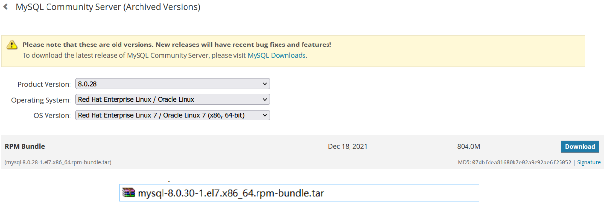

# JAVA开发扩展之软件包与安装

# 学习目标

1 熟练使用RPM查询、安装、卸载软件

2 熟练使用YUM安装程序

## 第一节 RPM

1 什么是RPM

```text
RPM（RedHat Package Manager），RedHat软件包管理工具，类似windows里面的setup.exed.是Linux这系列操作系统里面的打包安装工具，它虽然是RedHat的标志，但理念是通用的。

```

2 RPM包的名称格式

```纯文本
Apache-1.3.23-11.i386.rpm
​    -  “apache” 软件名称
​    -  “1.3.23-11”软件的版本号，主版本和次版本
​    -  “i386”是软件所运行的硬件平台，Intel 32位微处理器的统称
​    -  “rpm”文件扩展名，代表RPM包
```

> RPM查询命令

-   基础语法
    ```纯文本
    rpm -qa       （功能描述：查询所安装的所有rpm软件包）
    rpm -ql  服务名 (功能描述:查看安装位置)
    ```
-   经验技巧
    ```纯文本
    由于软件包比较多，一般都会采取过滤。rpm -qa | grep rpm软件包
    ```
-   实操案例
    -   （1）查询firefox软件安装情况
    ```纯文本
    [root@hadoop101 Packages]# rpm -qa |grep firefox 
    firefox-45.0.1-1.el6.centos.x86_64
    ```

> RPM卸载命令

-   基本语法
    ```纯文本
    （1）rpm -e   软件包  
    （2）rpm -e --nodeps 软件包
    ```
-   选项说明
    | 选项       | 功能                                          |
    | -------- | ------------------------------------------- |
    | -e       | 卸载软件包                                       |
    | --nodeps | 卸载软件时，不检查依赖。这样的话，那些使用该软件包的软件在此之后可能就不能正常工作了。 |
-   实操案例
    -   （1）卸载firefox软件
    ```纯文本
    [root@hadoop101 Packages]# rpm -e firefox
    ```

> RPM安装命令

-   基本语法
    ```纯文本
    rpm -ivh RPM  包全名
    ```
-   选项说明
    | 选项       | 功能                |
    | -------- | ----------------- |
    | -i       | -i=install，安装     |
    | -v       | -v=verbose，显示详细信息 |
    | -h       | -h=hash，进度条       |
    | --nodeps | --nodeps，不检测依赖进度  |
-   实操案例
    -   （1）安装firefox软件
    ```纯文本
    [root@hadoop101 Packages]# pwd
    /media/CentOS_6.8_Final/Packages
    [root@hadoop101 Packages]# rpm -ivh firefox-45.0.1-1.el6.centos.x86_64.rpm 
    warning: firefox-45.0.1-1.el6.centos.x86_64.rpm: Header V3 RSA/SHA1 Signature, key ID c105b9de: NOKEY
    Preparing...        ########################################### [100%]
      1:firefox        ########################################### [100%]
    ```

## 第二节 YUM

1 什么是YUM

```纯文本
YUM（全称为 Yellow dog Updater, Modified）是一个在Fedora和RedHat以及CentOS中的Shell前端软件包管理器。基于RPM包管理，能够从指定的服务器自动下载RPM包并且安装，可以自动处理依赖性关系，并且一次安装所有依赖的软件包，无须繁琐地一次次下载、安装。该功能类似手机中的应用商店,通过网络下载程序包安装即可.功能类似在JAVA中使用MAVEN工具从远程仓库中下载依赖一样,可以自动处理依赖关系.YUM
```


> yum安装程序命令

-   基本语法
    ```纯文本
    yum [选项] [参数]
    ```
-   选项说明
    | 选项 | 功能            |
    | -- | ------------- |
    | -y | 对所有提问都回答“yes” |
-   参数说明
    | 参数           | 功能               |
    | ------------ | ---------------- |
    | install      | 安装rpm软件包         |
    | update       | 更新rpm软件包         |
    | check-update | 检查是否有可用的更新rpm软件包 |
    | remove       | 删除指定的rpm软件包      |
    | list         | 显示软件包信息          |
    | clean        | 清理yum过期的缓存       |
    | deplist      | 显示yum软件包的所有依赖关系  |
-   实操案例
    -   （1）通过yum获取火狐浏览器软件包名称
    ```纯文本
    [root@hadoop101 ~]#yum list | grep firefox
    ```
    -   （2）采用yum方式安装firefox
    ```纯文本
    [root@hadoop101 ~]#yum -y install firefox.x86_64
    ```

# 实战演练

```
演练目标：
（1）安装jdk
（2）安装mysql8.0
```

## 第一节 安装JDK

> 第一步 查询系统中自带的JDK

```纯文本
rpm -qa | grep jdk
```

> 第二步 卸载系统中自带的JDK

```纯文本
rpm -e --nodeps jdk的rpm软件包的名字
```

> 第三步 将jdk.tar.gz上传到/opt目录下

> 第四步 解压jdk压缩包

```纯文本
tar -zxvf jdk压缩包名称
```

> 第五步 在/etc/profile.d目录下创建my\_env.sh文件(系统不建议直接修改/etc/profile)

```纯文本
cd /etc/profile.d
touch my_env.sh
```

> 第六步 在my\_env.sh文件中配置JAVA\_HOME环境变量

```纯文本
#JAVA_HOME  
JAVA_HOME=/opt/jdk-1.8.0  
PATH=$PATH:$JAVA_HOME/bin  
export PATH JAVA_HOME 
```

> 第七步 执行source /etc/profile.d/my\_env.sh使环境变量立即生效，如果不生效就重启XShell

## 第二节 安装 MySQL

> 第一步 卸载系统中自带的mysql

```纯文本
检查mariadb
rpm -qa | grep mariadb
卸载mariadb
rpm -e --nodeps mariadb-libs
```

> 第二步 下载mysql8安装包

- 下载地址[https://downloads.mysql.com/archives/community/](https://downloads.mysql.com/archives/community/ "https://downloads.mysql.com/archives/community/")



> 第三步 上传mysql压缩包到/opt 然后解压

```纯文本
tar -xvf mysql-8.0.30-1.el7.x86_64.rpm-bundle.tar
```

> 第四步 解压后按照如下顺序进行安装


```纯文本
rpm -ivh mysql-community-common-8.0.30-1.el7.x86_64.rpm
rpm -ivh mysql-community-client-plugins-8.0.30-1.el7.x86_64.rpm
rpm -ivh mysql-community-libs-8.0.30-1.el7.x86_64.rpm 
rpm -ivh mysql-community-client-8.0.30-1.el7.x86_64.rpm
rpm -ivh mysql-community-icu-data-files-8.0.30-1.el7.x86_64.rpm
rpm -ivh mysql-community-server-8.0.30-1.el7.x86_64.rpm
```

> 第五步 对MySQL进行初始化

```纯文本
mysqld --initialize --console
```

> 第六步  修改mysql安装目录的所有用户和所属组

```纯文本
chown -R mysql:mysql /var/lib/mysql/
```

> 第七步 查看mysql的临时密码

```纯文本
cat /var/log/mysqld.log | grep localhost
```

> 第八步 登录mysql,并修改密码

```纯文本
登录
mysql -uroot -p
修改密码
alter user 'root'@'localhost' identified by 'root';
```